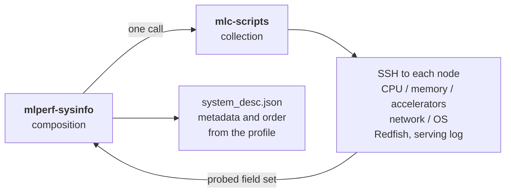
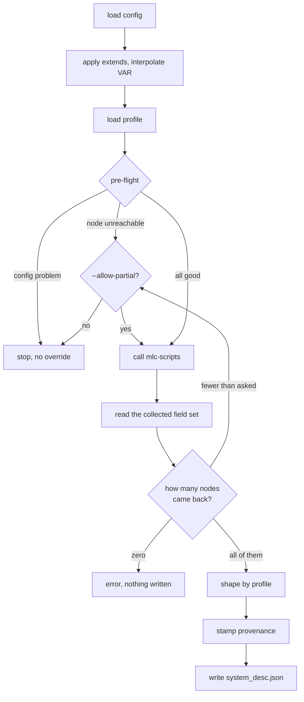

# Architecture

## The one idea

**mlc-scripts collects. mlperf-sysinfo composes.**

Probing a machine is hard, platform-specific work that should stay shared and
unchanged across MLCommons. Deciding what a working group must supply, and what
the resulting file should look like, is policy. Policy differs per group, so it
belongs in a package groups can configure.



The split runs along one line: **the automation owns what the hardware is, this
package owns everything a person had to type.** The profile's `benchmark` names
which field set to gather, because the Endpoints and Inference field sets are
not the same shape and are not interchangeable. What comes back is treated as
the probed truth. What each submitter-supplied field *says* is decided here.

!!! warning "Why the metadata is not left to the automation"
    The automation's defaults for submitter-supplied fields are placeholder
    strings: `"Insert system category here"`. A placeholder in a submission
    file is worse than an empty one, because it reads as filled in. So every
    such field is written from the config or left genuinely empty, and
    `check` is what refuses to run when one that matters is empty.

!!! note "A profile still costs no automation change"
    Requirements, recommendations, field order, which optional probes run and
    what the file is called are all profile data. A new group that can use an
    existing field set is one YAML file.

## Module map

| Module | Responsibility |
| --- | --- |
| `config.py` | The config schema, `extends` merging, `${VAR}` interpolation, placeholder detection |
| `profiles/` | What each working group requires, collects, and writes. YAML, no Python |
| `preflight.py` | Validation and reachability, the `check` command's engine |
| `collector.py` | Invokes the automation, verifies what came back, orchestrates the run |
| `output.py` | Orders the collected field set, overlays config metadata, stamps provenance |
| `report.py` | Reads a captured file back for `show` and `validate` |
| `cli.py` / `ui.py` | The command line and its rendering |
| `errors.py` | Every deliberate failure is one of these |

The `mlc-scripts` dependency is pinned to an exact pre-release, `1.2.0a5`, which
is the version this package is tested against. `pip` installs it without any
flag because the specifier names the pre-release explicitly; `uv` needs
`prerelease = "allow"`, which `pyproject.toml` already sets.

## What a capture actually does



### Two kinds of problem, handled differently

This distinction is the core of the design.

| Kind | Examples | Behaviour |
| --- | --- | --- |
| **Config problem** | Missing required field, `CHANGEME` left in, unset `${VAR}`, node group counts that exceed the nodes configured | Hard stop. **No override.** Cheap to fix, and they produce bad submissions |
| **Reachability problem** | A node that will not answer, fewer nodes returning hardware than were asked for | Stops the run, but `--allow-partial` proceeds and marks the output partial |

### Verifying what came back

A node can be perfectly reachable and still return nothing, such as an
unsupported OS or a probe that needs `sudo`. So the node count is taken from the collected data,
never from the config:

- **zero nodes** → always an error, even with `--allow-partial`. No file written.
- **fewer than asked for** → partial. Error unless `--allow-partial`.
- **all of them** → complete.

!!! warning "This was a real bug"
    The first cut trusted the request over the result and wrote
    `complete: true` for a capture that collected nothing. Believing the
    request is exactly how a capture silently ships half a system.

## Where files land

The deliverable is the only thing written to `output.dir`. Everything the
automation produces goes into a scratch directory beside it:

```text
results/my_run/
├── system_desc.json                 ← the deliverable
└── .mlperf-sysinfo/
    ├── capture_20260819_202120.log  ← the run log
    ├── raw-system-info.json         ← the field set mlc-scripts returned
    └── mlperf-system-info-single-node-0.json
```

Redfish captures (`redfish_nameplate_power.yaml`, `redfish_capture.yaml`) are
deliverables in their own right and are lifted back out into `output.dir`.

## The run log

Every `capture` writes one, named after the time it started so a retry leaves
the log of the failure that prompted it in place. It opens with what produced
the run and closes with how it ended:

```text
mlperf-sysinfo capture — 20260819_202120
Started   : 2026-08-19T20:21:20+05:30
Versions  : mlperf-sysinfo 1.0.0a8, mlc-scripts 1.2.0a5
Profile   : endpoints (round 6.0, benchmark endpoints)
Config    : /home/user/sysinfo.yaml
Output    : /home/user/results/my_run/system_desc.json
Nodes     : 2 -- this machine, root@node1:22
Invoked   : mlperf-sysinfo capture -c sysinfo.yaml

[2026-08-19 20:21:20] INFO     config: loaded config /home/user/sysinfo.yaml (profile endpoints)
[2026-08-19 20:21:20] INFO     preflight: 5 of 5 required field(s) set for profile endpoints
[2026-08-19 20:21:20] INFO     collector: collecting with tags: get-mlperf-multi-node-system-info,_cuda,_endpoints
[2026-08-19 20:21:22] Skipping password prompt - non-interactive terminal detected!
[2026-08-19 20:21:33,496 deprecation.py :  66 WARN ] - Your mlcflow version is deprecated
                        Please upgrade to mlcflow >= 1.3.0
[2026-08-19 20:21:27] INFO     collector: 1 of 1 node(s) returned hardware
[2026-08-19 20:21:27] INFO     output: 3 field(s) blank in the written file (unset in config, or not detected): hw_notes, link_config, sw_notes
[2026-08-19 20:21:27] INFO     collector: wrote /home/user/results/my_run/system_desc.json

------------------------------------------------------------------------
Finished  : 2026-08-19T20:21:27+05:30
Duration  : 6.6s
Outcome   : complete -- 1 of 1 node(s)
```

Four things about the body are deliberate:

- **This package's own actions are in there**, at a level and with the module
  that took them, not just the automation's output. What the automation returned
  and what was concluded from it are different things, and the second is usually
  what is being reconstructed. Every level reaches the file regardless of what
  the terminal is set to. See [Logging](commands.md#logging).
- **Lines mlcflow already stamped keep their own stamp.** A second one in front
  would only push the real timestamp out of the reader's eye line. The two
  styles are close enough on purpose, so a mixed log still reads down the page.
- **Indented lines are indented, not stamped.** They are the tail of the
  message above, such as the wrapped rest of a warning or the frames of a
  traceback.
  A stamp on each claims they were logged separately and pulls the block apart.
- **Records from before the file existed are replayed into it.** Loading the
  config and the whole pre-flight check happen before an output directory is
  touched, so they are buffered and written in once the file opens. Those early
  records are usually the interesting ones.

The round belongs in the header for the same reason it is stamped into every
output file and printed nowhere on the terminal: a file read weeks later has to
say which rules produced it.

Pass `--verbose` to watch the automation on the terminal as well. The log is
still written either way.

## Known limitations

!!! danger "Credentials can reach the run log"
    Keeping secrets in `${VAR}` keeps them out of your config file and out of
    git, but the underlying automation prints its own command lines. A Redfish
    password may appear in the log. Treat `.mlperf-sysinfo/` as sensitive.

!!! danger "Remote scratch files are not confined"
    When collecting over SSH, the automation writes temporary files on each
    remote node, under `$HOME` and `/tmp` there. This package cannot redirect
    those, because its environment does not propagate over the automation's own
    SSH leg.
